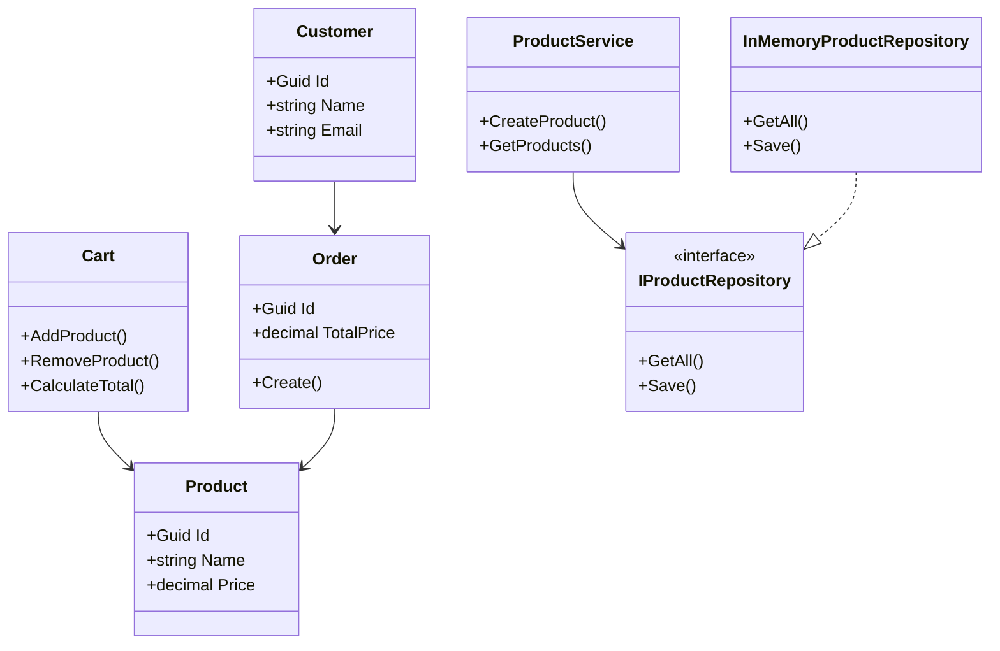

# Class Diagram

```mermaid
classDiagram

class Product {
    +Guid Id
    +string Name
    +decimal Price
}

class Cart {
    +AddProduct()
    +RemoveProduct()
    +CalculateTotal()
}

class Order {
    +Guid Id
    +decimal TotalPrice
    +Create()
}

class Customer {
    +Guid Id
    +string Name
    +string Email
}

class IProductRepository {
    <<interface>>
    +GetAll()
    +Save()
}

class ProductService {
    +CreateProduct()
    +GetProducts()
}

class InMemoryProductRepository {
    +GetAll()
    +Save()
}

ProductService --> IProductRepository
InMemoryProductRepository ..|> IProductRepository

Cart --> Product
Order --> Product
Customer --> Order
```